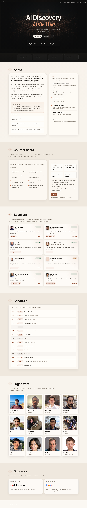
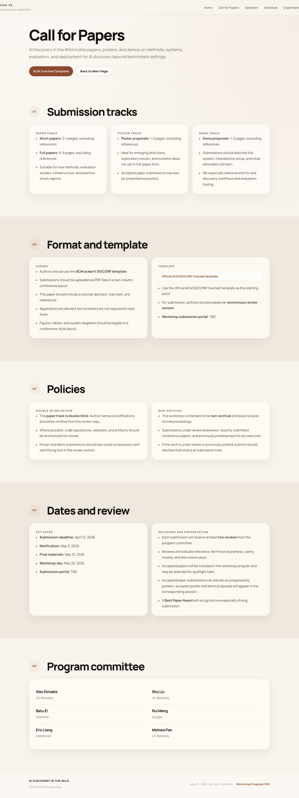
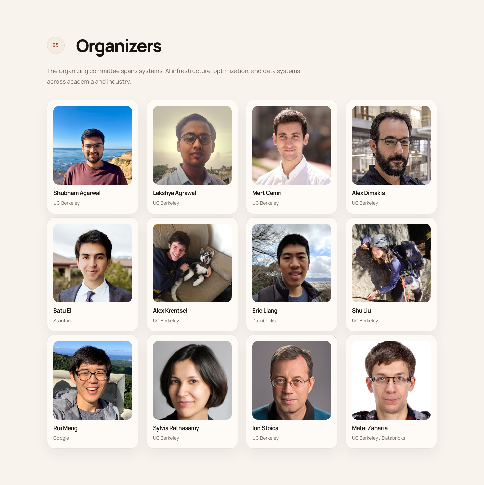

# AI Discovery in the Wild

Static website for the ACM CAIS 2026 workshop **AI Discovery in the Wild**.

## Preview

| Home | CFP |
| --- | --- |
|  |  |

| Organizers | Mobile |
| --- | --- |
|  |  |

## Run locally

```bash
./serve.sh
```

Then open `http://127.0.0.1:8090`.

## Project structure

- `index.html`: main workshop site
- `cfp.html`: detailed call for papers page
- `style.css`: shared styles
- `hero-bg.png`: hero background artwork
- `assets/`: speaker photos, organizer photos, and sponsor logos
- `AI_Discovery_in_the_Wild_Workshop_Proposal.pdf`: workshop proposal PDF

## Notes

- The site is fully static and GitHub Pages friendly.
- No build step or package install is required.
- Desktop and phone layouts were checked locally with browser screenshots.
- External links point to speaker homepages, sponsor sites, and the official paper template.
